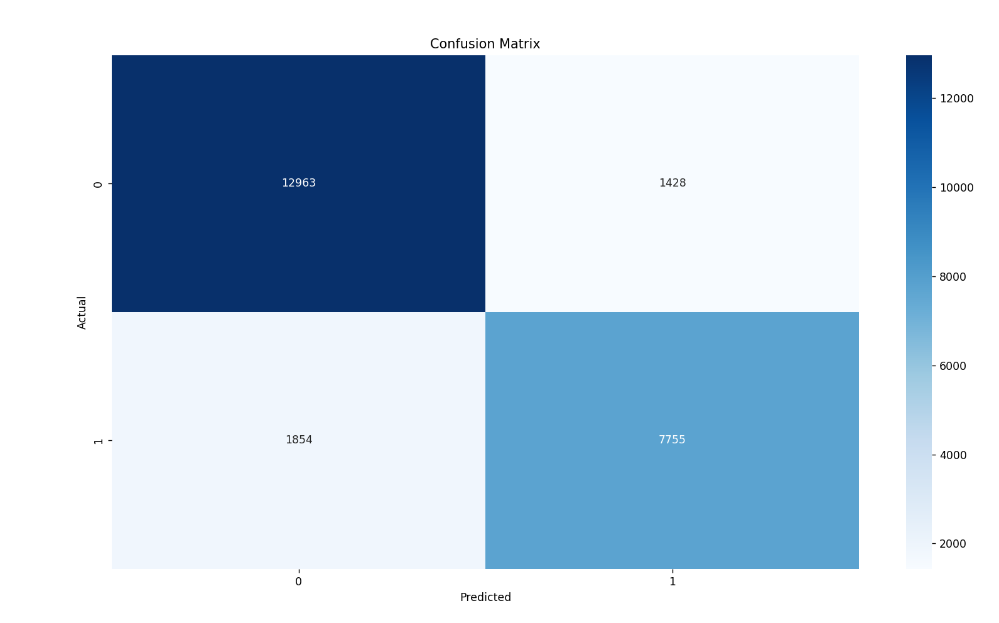

# ⚡ Energy Theft Detection with Yearly Average Feature & Dashboard


Detect potential electricity theft using **Random Forest** and **yearly average consumption trends**. Includes a dashboard to classify customer risk levels and highlight high-risk cases.

## 🔹 Key Features

* Generate or load **balanced synthetic dataset** for Normal, Medium, and High-risk customers.
* Compute **yearly average consumption** per customer for improved model accuracy.
* **Random Forest classifier** to detect potential theft.
* **Vacation adjustment** to reduce false positives.
* **Dashboard visualization** including:

  * Customer risk distribution
  * Top high-risk customers
  * Feature importance


## 📊 Dataset

* **File:** `energy_balanced_data.csv`
* **Columns:**

| Column            | Description                            |
| ----------------- | -------------------------------------- |
| `customer_id`     | Unique customer ID                     |
| `month`           | Month (1–12)                           |
| `consumption_kwh` | Monthly electricity consumption        |
| `is_theft`        | Label: 0 = Normal, 1 = Potential Theft |
| `yearly_avg`      | Computed yearly average consumption    |

> Dataset is synthetic but modeled to mimic real-world electricity usage.

[Download Dataset](./energy_balanced_data.csv)


## ⚡ Quick Start

1. Clone the repository:

```bash
git clone https://github.com/<your-username>/energy-theft-detection.git
cd energy-theft-detection
```

2. Install dependencies:

```bash
pip install -r requirements.txt
```

3. Run the main script:

```bash
python energy_theft_detection.py
```

---

## 🛠 How It Works

1. **Load or generate dataset** – 1000+ customers, 12 months each.
2. **Feature Engineering** – Compute `yearly_avg` per customer.
3. **Train Model** – Random Forest (300 trees).
4. **Evaluate Model** – Accuracy, confusion matrix, classification report, feature importance.
5. **Predict New Customer** – Input monthly consumption, yearly average, vacation status.
6. **Dashboard** – Visualize risk levels and top high-risk customers.


## 📈 Dashboard & Visualization

* **Risk Distribution:** Normal, Medium, High Risk
* **Top High-Risk Customers:** Sorted by theft probability
* **Feature Importance:** Contribution of month, consumption, yearly average

**Sample Dashboard:**


## 🧪 Example Prediction

text
Month: 5
Consumption: 180 kWh
Yearly Average: 300 kWh
Vacation: yes

Output: ⚠️ Alert! Possible energy theft (Probability: 0.75)


* Threshold for High Risk: 0.7
* Vacation adjustment reduces probability to avoid false positives


## 💾 Save & Load Model

python
# Save model
joblib.dump(model, "energy_theft_yearlyavg_model.pkl")

# Load model
model = joblib.load("energy_theft_yearlyavg_model.pkl")


## 📊 Results

* **Accuracy:** Replace with your model score
* **Classification Report:** Precision, Recall, F1-score for Normal vs Theft
* **Feature Importance Ranking:** `consumption_kwh > yearly_avg > month`


## 🚀 Future Enhancements

* Integrate **real electricity consumption datasets**.
* Add **seasonal, regional, and holiday adjustments**.
* Build an **interactive web dashboard** using Streamlit or Dash.
* Include **unsupervised anomaly detection** for rare theft patterns.


## 📷 Screenshots

| Screenshot                                             | Description                  |
| ------------------------------------------------------ | ---------------------------- |
|      | Model performance evaluation |
|  | Feature impact on prediction |
|          | Customer risk classification |


## 📄 License

MIT License – See [LICENSE](./LICENSE)

Author-TejaHussain💖
